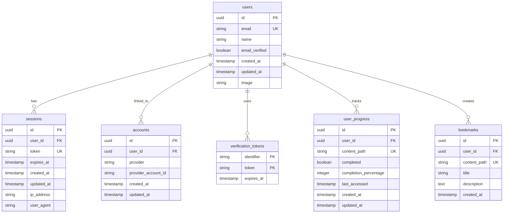

# Data Model: Authentication System

**Version**: 1.0 | **Date**: 2024-12-18
**Database**: PostgreSQL 14+ with UUID primary keys
**ORM**: Prisma 5.x for type-safe database access
**Authentication**: better-auth with default configuration

## Entity Relationship Overview



## Core Authentication Tables (better-auth)

### Users Table
```sql
CREATE TABLE users (
    id UUID PRIMARY KEY DEFAULT gen_random_uuid(),
    email VARCHAR(255) UNIQUE NOT NULL,
    email_verified BOOLEAN DEFAULT FALSE,
    name VARCHAR(255),
    image VARCHAR(255),
    created_at TIMESTAMP DEFAULT CURRENT_TIMESTAMP,
    updated_at TIMESTAMP DEFAULT CURRENT_TIMESTAMP
);

-- Performance indexes
CREATE INDEX CONCURRENTLY idx_user_email ON users(email);
CREATE INDEX CONCURRENTLY idx_user_created_at ON users(created_at);
CREATE INDEX CONCURRENTLY idx_user_email_verified ON users(email_verified);
```

**Fields**:
- `id`: UUID primary key (better-auth default)
- `email`: User email address (unique, required)
- `email_verified`: Boolean flag for email verification status
- `name`: Display name for the user
- `image`: Profile image URL
- `created_at`: Account creation timestamp
- `updated_at`: Last update timestamp

**Validation Rules**:
- Email: Valid email format, unique across all users
- Name: Max 255 characters, optional
- Image: Valid URL format, optional

### Sessions Table
```sql
CREATE TABLE sessions (
    id UUID PRIMARY KEY DEFAULT gen_random_uuid(),
    user_id UUID NOT NULL REFERENCES users(id) ON DELETE CASCADE,
    token VARCHAR(255) UNIQUE NOT NULL,
    expires_at TIMESTAMP NOT NULL,
    created_at TIMESTAMP DEFAULT CURRENT_TIMESTAMP,
    updated_at TIMESTAMP DEFAULT CURRENT_TIMESTAMP,
    ip_address INET,
    user_agent TEXT
);

-- Performance indexes
CREATE INDEX CONCURRENTLY idx_session_user_id ON sessions(user_id);
CREATE INDEX CONCURRENTLY idx_session_token ON sessions(token);
CREATE INDEX CONCURRENTLY idx_session_expires_at ON sessions(expires_at);
```

**Fields**:
- `id`: UUID primary key
- `user_id`: Foreign key to users table
- `token`: Unique session token
- `expires_at`: Session expiration timestamp
- `created_at`: Session creation timestamp
- `updated_at`: Last update timestamp
- `ip_address`: IP address of session creation
- `user_agent`: User agent string

**Validation Rules**:
- Token: Unique, required, generated by better-auth
- Expires: Must be future timestamp
- User ID: Must exist in users table

### Accounts Table (Social Providers)
```sql
CREATE TABLE accounts (
    id UUID PRIMARY KEY DEFAULT gen_random_uuid(),
    user_id UUID NOT NULL REFERENCES users(id) ON DELETE CASCADE,
    provider VARCHAR(255) NOT NULL,
    provider_account_id VARCHAR(255) NOT NULL,
    created_at TIMESTAMP DEFAULT CURRENT_TIMESTAMP,
    updated_at TIMESTAMP DEFAULT CURRENT_TIMESTAMP,
    UNIQUE(provider, provider_account_id)
);

-- Performance indexes
CREATE INDEX CONCURRENTLY idx_account_user_id ON accounts(user_id);
CREATE INDEX CONCURRENTLY idx_account_provider ON accounts(provider);
```

**Fields**:
- `id`: UUID primary key
- `user_id`: Foreign key to users table
- `provider`: OAuth provider name (e.g., 'google', 'github')
- `provider_account_id`: Provider-specific user ID
- `created_at`: Account linkage timestamp
- `updated_at`: Last update timestamp

**Validation Rules**:
- Provider + Provider Account ID: Unique combination
- User ID: Must exist in users table

### Verification Tokens Table
```sql
CREATE TABLE verification_tokens (
    identifier VARCHAR(255) NOT NULL,
    token VARCHAR(255) NOT NULL,
    expires_at TIMESTAMP NOT NULL,
    PRIMARY KEY (identifier, token)
);

-- Performance indexes
CREATE INDEX CONCURRENTLY idx_verification_token_expires ON verification_tokens(expires_at);
```

**Fields**:
- `identifier`: Email address or other identifier
- `token`: Verification token
- `expires_at`: Token expiration timestamp

**Validation Rules**:
- Identifier + Token: Unique combination
- Expires: Must be future timestamp

## Application-Specific Tables

### User Progress Table
```sql
CREATE TABLE user_progress (
    id UUID PRIMARY KEY DEFAULT gen_random_uuid(),
    user_id UUID NOT NULL REFERENCES users(id) ON DELETE CASCADE,
    content_path VARCHAR(255) NOT NULL,
    completed BOOLEAN DEFAULT FALSE,
    completion_percentage INTEGER DEFAULT 0 CHECK (completion_percentage >= 0 AND completion_percentage <= 100),
    last_accessed TIMESTAMP DEFAULT CURRENT_TIMESTAMP,
    created_at TIMESTAMP DEFAULT CURRENT_TIMESTAMP,
    updated_at TIMESTAMP DEFAULT CURRENT_TIMESTAMP,
    UNIQUE(user_id, content_path)
);

-- Performance indexes
CREATE INDEX CONCURRENTLY idx_user_progress_user_id ON user_progress(user_id);
CREATE INDEX CONCURRENTLY idx_user_progress_content_path ON user_progress(content_path);
CREATE INDEX CONCURRENTLY idx_user_progress_completed ON user_progress(completed);
CREATE INDEX CONCURRENTLY idx_user_progress_last_accessed ON user_progress(last_accessed);
```

**Fields**:
- `id`: UUID primary key
- `user_id`: Foreign key to users table
- `content_path`: Documentation page path (e.g., '/docs/quarter-1/intro')
- `completed`: Boolean flag for completion status
- `completion_percentage`: 0-100 percentage completed
- `last_accessed`: Last time user accessed this content
- `created_at`: Progress tracking start timestamp
- `updated_at`: Last progress update timestamp

**Validation Rules**:
- User ID + Content Path: Unique combination (one progress record per user per content)
- Completion Percentage: Integer between 0 and 100
- Content Path: Valid URL path format

### Bookmarks Table
```sql
CREATE TABLE bookmarks (
    id UUID PRIMARY KEY DEFAULT gen_random_uuid(),
    user_id UUID NOT NULL REFERENCES users(id) ON DELETE CASCADE,
    content_path VARCHAR(255) NOT NULL,
    title VARCHAR(255),
    description TEXT,
    created_at TIMESTAMP DEFAULT CURRENT_TIMESTAMP,
    UNIQUE(user_id, content_path)
);

-- Performance indexes
CREATE INDEX CONCURRENTLY idx_bookmark_user_id ON bookmarks(user_id);
CREATE INDEX CONCURRENTLY idx_bookmark_content_path ON bookmarks(content_path);
CREATE INDEX CONCURRENTLY idx_bookmark_created_at ON bookmarks(created_at);
```

**Fields**:
- `id`: UUID primary key
- `user_id`: Foreign key to users table
- `content_path`: Documentation page path being bookmarked
- `title`: Custom title for the bookmark
- `description`: User notes about the bookmark
- `created_at`: Bookmark creation timestamp

**Validation Rules**:
- User ID + Content Path: Unique combination (one bookmark per user per content)
- Title: Max 255 characters, optional
- Description: Free text, optional

## Prisma Schema

```prisma
// schema.prisma
generator client {
  provider = "prisma-client-js"
}

datasource db {
  provider = "postgresql"
  url      = env("DATABASE_URL")
}

model User {
  id            String    @id @default(dbgenerated("gen_random_uuid()")) @db.Uuid
  email         String    @unique
  emailVerified Boolean   @default(false) @map("email_verified")
  name          String?
  image         String?
  createdAt     DateTime  @default(now()) @map("created_at")
  updatedAt     DateTime  @updatedAt @map("updated_at")

  // Relations
  accounts          Account[]
  sessions          Session[]
  verificationTokens VerificationToken[]
  userProgress      UserProgress[]
  bookmarks         Bookmark[]

  @@map("users")
}

model Account {
  id                String  @id @default(dbgenerated("gen_random_uuid()")) @db.Uuid
  userId            String  @map("user_id") @db.Uuid
  provider          String
  providerAccountId String  @map("provider_account_id")
  createdAt         DateTime @default(now()) @map("created_at")
  updatedAt         DateTime @updatedAt @map("updated_at")

  // Relations
  user User @relation(fields: [userId], references: [id], onDelete: Cascade)

  @@unique([provider, providerAccountId])
  @@map("accounts")
}

model Session {
  id        String   @id @default(dbgenerated("gen_random_uuid()")) @db.Uuid
  userId    String   @map("user_id") @db.Uuid
  token     String   @unique
  expiresAt DateTime @map("expires_at")
  createdAt DateTime @default(now()) @map("created_at")
  updatedAt DateTime @updatedAt @map("updated_at")
  ipAddress String?  @map("ip_address") @db.Inet
  userAgent String?  @map("user_agent") @db.Text

  // Relations
  user User @relation(fields: [userId], references: [id], onDelete: Cascade)

  @@map("sessions")
}

model VerificationToken {
  identifier String   @map("identifier")
  token      String
  expiresAt  DateTime @map("expires_at")

  @@unique([identifier, token])
  @@map("verification_tokens")
}

model UserProgress {
  id                    String   @id @default(dbgenerated("gen_random_uuid()")) @db.Uuid
  userId                String   @map("user_id") @db.Uuid
  contentPath           String   @map("content_path")
  completed             Boolean  @default(false)
  completionPercentage  Int      @default(0) @map("completion_percentage")
  lastAccessed          DateTime @default(now()) @map("last_accessed")
  createdAt             DateTime @default(now()) @map("created_at")
  updatedAt             DateTime @updatedAt @map("updated_at")

  // Relations
  user User @relation(fields: [userId], references: [id], onDelete: Cascade)

  @@unique([userId, contentPath])
  @@map("user_progress")
}

model Bookmark {
  id          String   @id @default(dbgenerated("gen_random_uuid()")) @db.Uuid
  userId      String   @map("user_id") @db.Uuid
  contentPath String   @map("content_path")
  title       String?
  description String?  @db.Text
  createdAt   DateTime @default(now()) @map("created_at")

  // Relations
  user User @relation(fields: [userId], references: [id], onDelete: Cascade)

  @@unique([userId, contentPath])
  @@map("bookmarks")
}
```

## Data Access Patterns

### Authentication Operations
```typescript
// Session validation
async function validateSession(token: string) {
  return await prisma.session.findUnique({
    where: { token },
    include: { user: true }
  });
}

// User creation
async function createUser(userData: {
  email: string;
  name?: string;
}) {
  return await prisma.user.create({
    data: userData
  });
}
```

### Progress Tracking Operations
```typescript
// Update progress
async function updateProgress(userId: string, contentPath: string, progress: {
  completed: boolean;
  completionPercentage: number;
}) {
  return await prisma.userProgress.upsert({
    where: {
      userId_contentPath: {
        userId,
        contentPath
      }
    },
    update: {
      ...progress,
      lastAccessed: new Date()
    },
    create: {
      userId,
      contentPath,
      ...progress
    }
  });
}

// Get user progress
async function getUserProgress(userId: string) {
  return await prisma.userProgress.findMany({
    where: { userId },
    orderBy: { lastAccessed: 'desc' }
  });
}
```

### Bookmark Operations
```typescript
// Create bookmark
async function createBookmark(userId: string, bookmark: {
  contentPath: string;
  title?: string;
  description?: string;
}) {
  return await prisma.bookmark.create({
    data: {
      userId,
      ...bookmark
    }
  });
}

// Get user bookmarks
async function getUserBookmarks(userId: string) {
  return await prisma.bookmark.findMany({
    where: { userId },
    orderBy: { createdAt: 'desc' }
  });
}
```

## Performance Considerations

### Database Indexes
- All foreign keys have indexes for efficient joins
- Unique constraints have supporting indexes
- Time-based fields (created_at, updated_at) indexed for queries
- Content paths indexed for progress and bookmark lookups

### Connection Pooling
```javascript
const pool = new Pool({
  connectionString: process.env.DATABASE_URL,
  max: 20,  // Maximum connections
  min: 2,   // Minimum connections
  idleTimeoutMillis: 30000,
  connectionTimeoutMillis: 2000,
});
```

### Cleanup Strategies
```sql
-- Clean up expired sessions
DELETE FROM sessions WHERE expires_at < NOW() - INTERVAL '7 days';

-- Clean up expired verification tokens
DELETE FROM verification_tokens WHERE expires_at < NOW();

-- Optional: Archive old progress data
CREATE MATERIALIZED VIEW user_completion_stats AS
SELECT
  user_id,
  COUNT(*) as total_items,
  SUM(CASE WHEN completed = true THEN 1 ELSE 0 END) as completed_items,
  AVG(completion_percentage) as avg_completion
FROM user_progress
GROUP BY user_id;
```

## Security Considerations

### Data Protection
- Passwords are handled by better-auth (hashed with bcrypt)
- Session tokens are stored securely with HTTP-only cookies
- PII (email, name) access is restricted to authenticated users

### Input Validation
- All inputs validated at the application level
- SQL injection prevented by Prisma ORM
- Content path validation prevents directory traversal

### Access Control
- Row-level security through user_id foreign keys
- Session-based authentication for all operations
- CORS restrictions for API access

---

**Migration Strategy**: The better-auth tables will be created automatically by the library. Custom tables (user_progress, bookmarks) will be created via Prisma migrations with proper foreign key relationships.